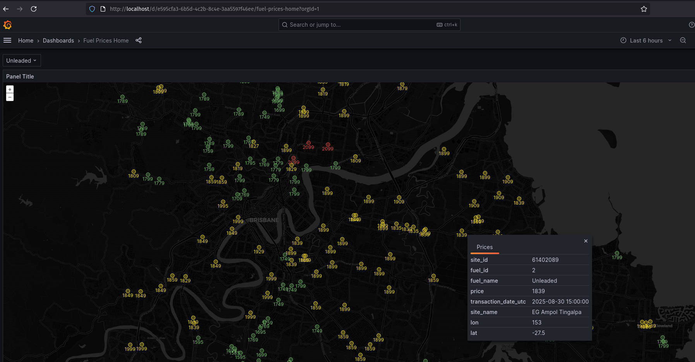

# QLD Fuel Prices Dashboard

A dashboard for the latest fuel prices in Queensland.



## Installation

Use poetry from dependency management and docker compose for runtime environment.

```sh
sudo apt-get update
sudo apt-get install docker-compose-plugin
poetry install
```

## Usage example

Run `docker compose up`.

## Overview

The application demonstrates a full data workflow (ETL) process. Data is initally extracted from the QLD fuel prices API: https://www.fuelpricesqld.com.au/ before being transformed and loaded into a local database (https://github.com/p-lahanas/fuelpricesqld). A frontend dashboard has been created to demonstrate how this data can be used for analysis/applications.

## Release History

- 0.0.1
  - Work in progress
